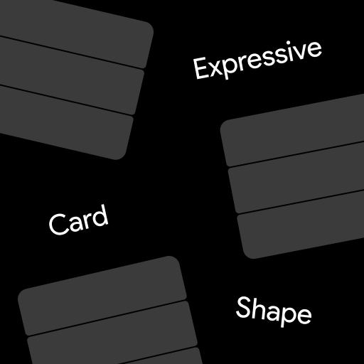
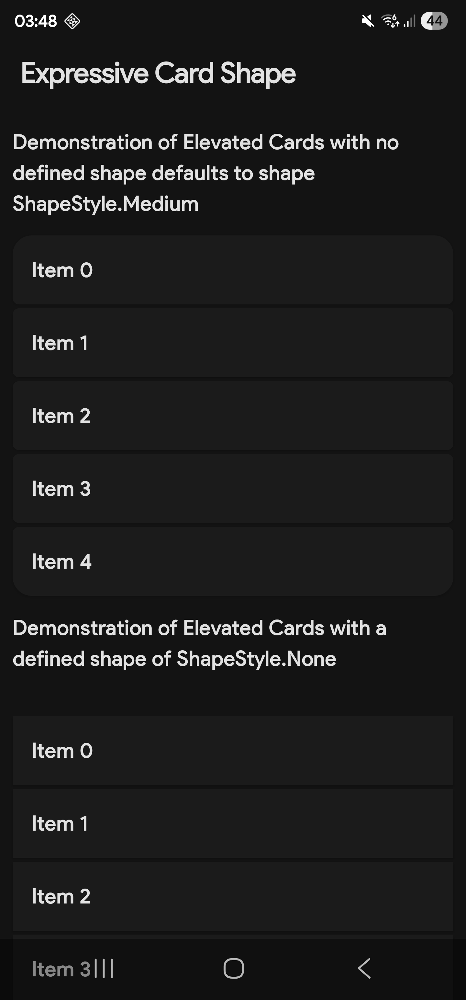
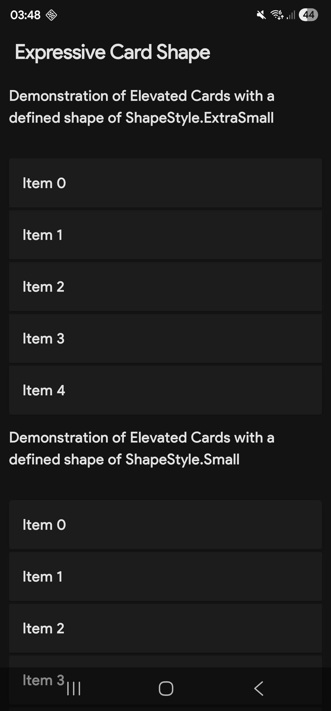
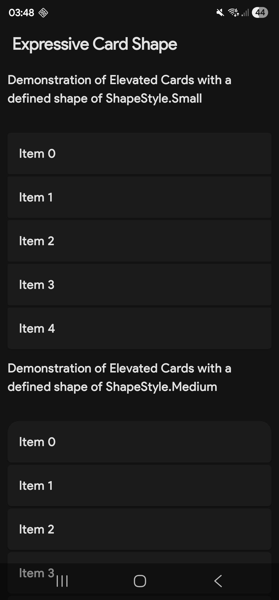
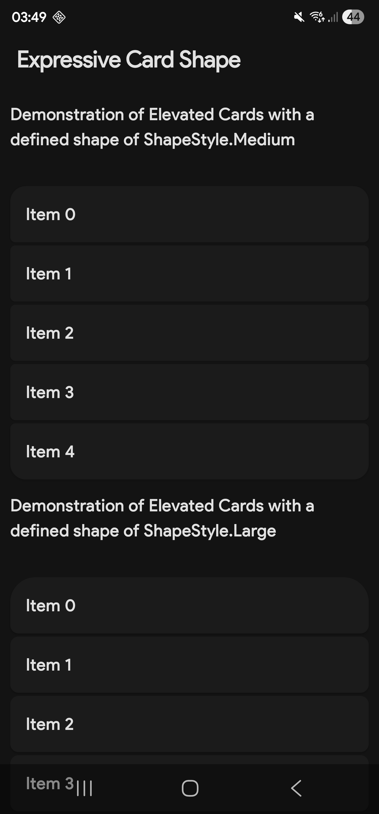
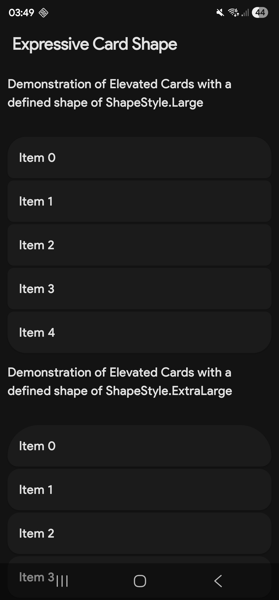
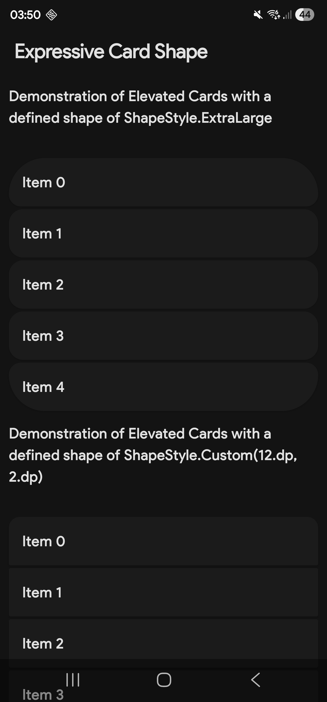
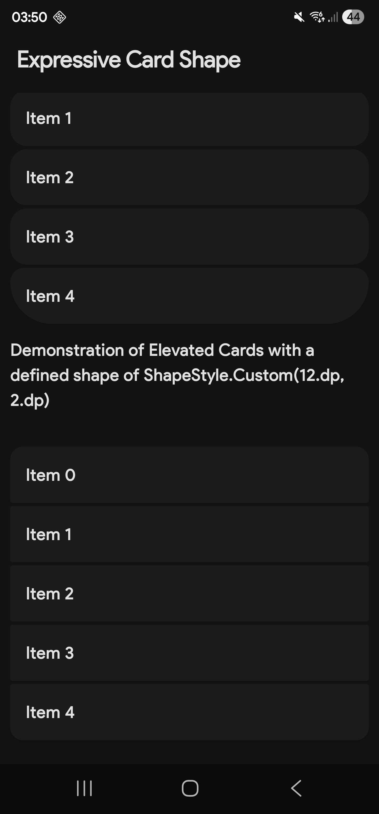

   

## ExpressiveCardShape
ExpressiveCardShape is an android library that provides material 3 expressive card style grouping

### Screenshots (Demo)

   
   
   
    
    
    
    
    
    

### Documentation
For detailed documentation, please visit the [DOC.md](DOC.md) file.

[Maven Central](https://central.sonatype.com/artifact/uk.co.bocajsolutions/cardshape)

### Licence

